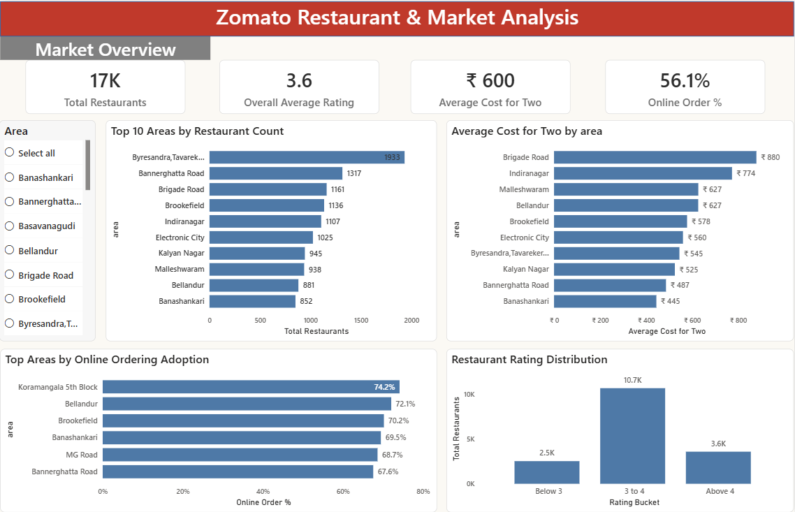
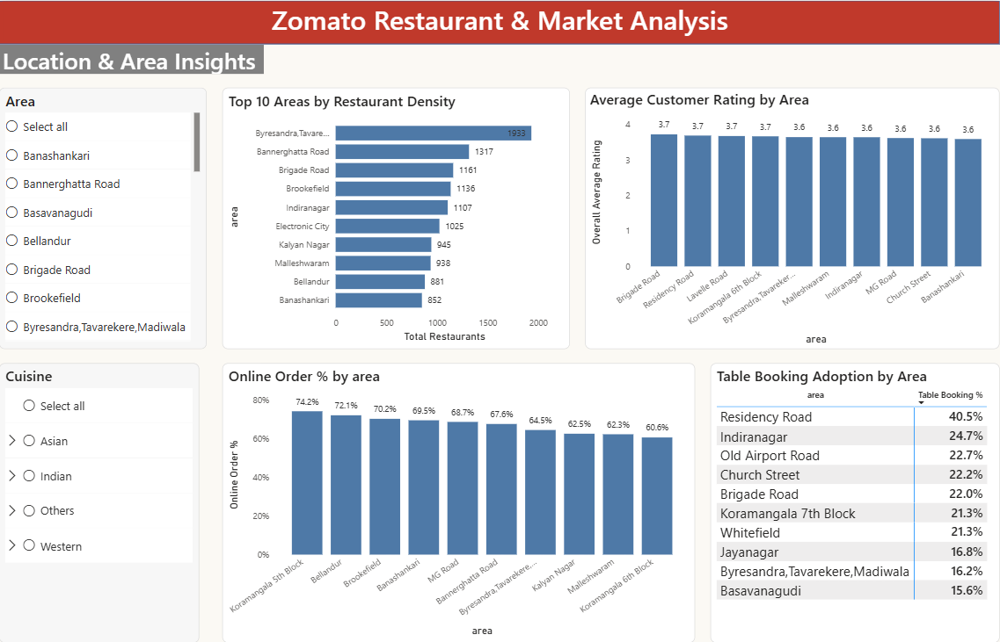
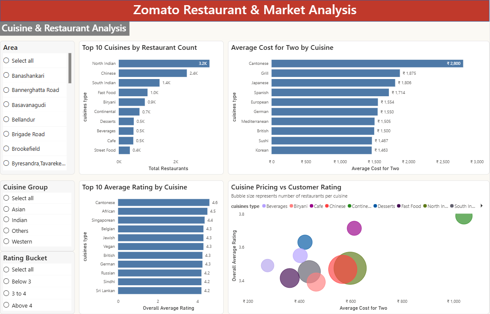
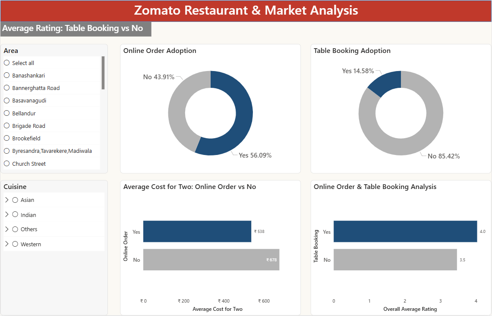

# Zomato Restaurant & Market Analysis (Power BI)

## Overview
Analyzed Zomato restaurant data to uncover patterns in **ratings, pricing, cuisine trends, and digital adoption**.  
The project transforms raw data into **interactive dashboards and actionable business insights** using Power BI.

---

## Tools & Technologies
- **Power BI Desktop** – Data visualization and modeling  
- **Power Query** – Data cleaning & transformation  
- **DAX** – Measures & calculations  
- **Dataset:** [Zomato Restaurant Dataset (CSV)](https://www.kaggle.com/datasets/abhijitdahatonde/zomato-restaurants-dataset?select=zomato.csv)

---

## Data Cleaning & Preparation
- Removed unnecessary columns and indices  
- Corrected data types and handled missing/inconsistent values  
- Cleaned rating fields 
- Split multi-cuisine entries into separate rows for accurate cuisine-level analysis  

---

## Key DAX Measures
- Total Restaurants  
- Overall Average Rating  
- Average Cost for Two  
- Online Ordering %  
- Table Booking %  
- Rating Buckets: Below 3, 3–4, Above 4  

---

## Dashboards
### 1️⃣ Market Overview
- KPIs: Total restaurants, average rating, average cost, online ordering %  
- Top 10 areas by restaurant count  
- Rating distribution and average cost by area  

### 2️⃣ Location & Area Insights
- Restaurant density and ratings by area  
- Online ordering & table booking adoption  
- Slicers: Area, Cuisine  

### 3️⃣ Cuisine & Restaurant Analysis
- Top cuisines by restaurant count  
- Average rating and cost by cuisine  
- Scatter plot: Cuisine pricing vs rating  

### 4️⃣ Online Ordering & Table Booking Analysis
- Compare online delivery vs table booking adoption  
- Assess impact on pricing and customer ratings  

---

## Key Insights
- High restaurant density does not always correspond to higher ratings  
- Digital adoption varies significantly by location  
- Higher pricing does not guarantee better customer satisfaction  
- Mid-priced cuisines often show strong customer ratings  

---

## How to Use
1. Open `zomato_restaurant_analysis.pbix` in Power BI Desktop  
2. Use slicers to explore insights by area, cuisine, and rating  
3. Navigate through dashboards to view different analytical perspectives  

---

## Screenshots

---

